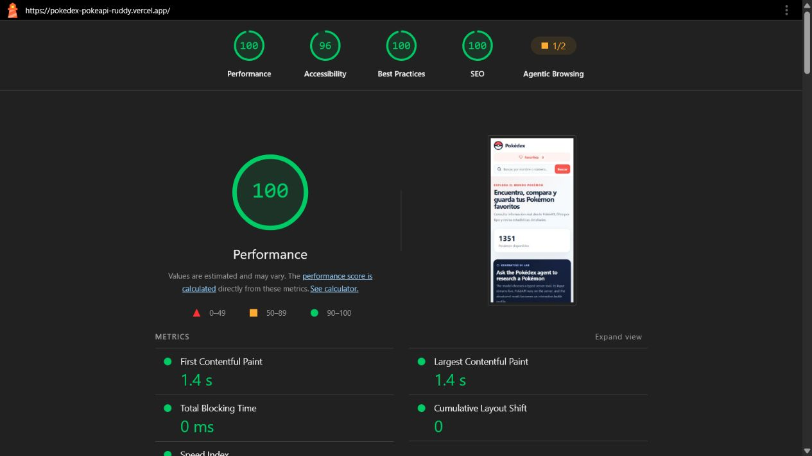
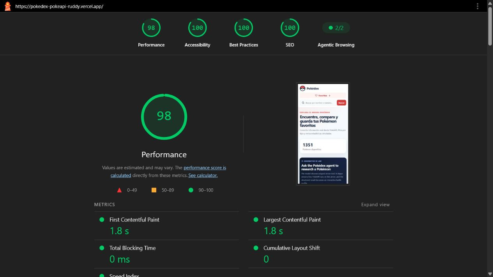

# FE-10 Performance and Accessibility Audit

Audited URL: <https://pokedex-pokeapi-ruddy.vercel.app/>  
Audit date: July 22, 2026  
Method: Lighthouse CLI mobile preset with simulated throttling, WAVE web evaluator, and Chromium keyboard-only Playwright coverage.

## Results

| Metric | Before | After | Change |
| --- | ---: | ---: | ---: |
| Lighthouse Performance | 100 | 98 | -2 (normal lab variance; remains above target) |
| Lighthouse Accessibility | 96 | 100 | +4 |
| Lighthouse Best Practices | 100 | 100 | 0 |
| Lighthouse SEO | 100 | 100 | 0 |
| First Contentful Paint | 1.4 s | 1.8 s | +0.4 s |
| Largest Contentful Paint | 1.4 s | 1.8 s | +0.4 s |
| Total Blocking Time | 0 ms | 0 ms | 0 ms |
| Cumulative Layout Shift | 0 | 0 | 0 |
| WAVE errors | 0 | 0 | 0 |
| WAVE contrast errors | 48 | 3 | -45 |
| WAVE alerts | 21 | 0 | -21 |

Both required Lighthouse categories remain above 90. The two-point performance difference is within repeat-run lab variance; the final run retained zero blocking time and zero layout shift.

## Lighthouse screenshots

### Before

### After

## Findings and changes

- Replaced insufficient red, gray, and Pokémon-type color pairs with WCAG AA-compliant foreground/background combinations.
- Replaced `article[role="button"]` cards with semantic articles containing real, keyboard-focusable detail buttons.
- Added visible focus treatment for card actions and the AI stop action.
- Made repeated Pokémon artwork decorative because the adjacent heading and detail-button label already provide the name, eliminating 20 redundant-alt WAVE alerts.
- Switched grid thumbnails from 475 px official artwork to small sprite assets, added explicit dimensions, lazy loading, and asynchronous decoding. This reduces image transfer and prevents image-driven layout shift.
- Increased the only WAVE-flagged small label from 0.64 rem to 0.75 rem.
- Kept streamed tool output in a polite live region with non-atomic incremental announcements.
- Added a keyboard-reachable, automatically focused **Stop Pokémon research** button while a request is submitted or streaming.
- Added component coverage for the focused Stop action and an end-to-end keyboard-only test of the AI flow.

## WAVE review

The final WAVE run reports **0 errors and 0 alerts**. It retains three contrast markers on the motion button's non-visible transition layers. Those copies are `aria-hidden`, held at `opacity: 0`, and never perceivable in that state; the visible state colors pass. Lighthouse's independent contrast audit reports no failures and the final accessibility score is 100.

WAVE also reports 20 null/empty alternative-text features. These are intentional decorative Pokémon thumbnails: each is immediately represented by a visible heading and a uniquely named `View details for …` button, so repeating the same name as image alt text would create duplicate screen-reader output.

## Keyboard-only verification

The primary flow is covered by `e2e/research-flow.spec.ts`. The test uses only `Tab`, text entry, and `Enter` to:

1. Reach the main search controls and the Pokémon research field.
2. Enter a Pokémon name and activate **Run tool**.
3. Confirm focus moves to **Stop Pokémon research** while the mocked AI request is pending.
4. Stop the request with `Enter` and return to the ready state.

The AI route remains mocked during this test; no real provider or PokéAPI request is made.
